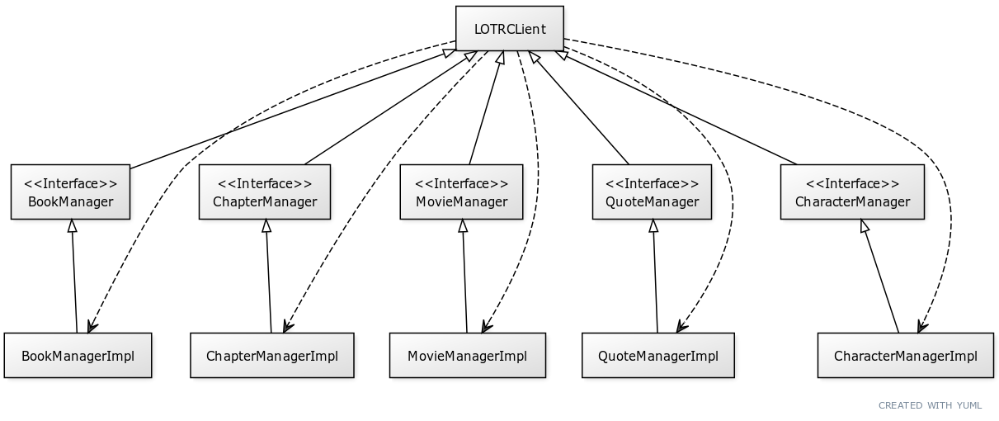

### Architecture:
#### class diagram:

#### sequence diagram:

### Rational:
The app is built using [Reactor Netty](https://projectreactor.io/docs/netty/release/reference/index.html) which supports creating reactive non-blocking http clients

* All methods are currently returning either a `Flux` or a `Mono` which represents a reactive stream, those are easily convertible to either a `Collection` or an `Object` respectively, but allow users with reactive application to consume the API in a non-blocking manner
* While HTTP payloads are not reactive by nature, using `Reactor Netty` allows us to support streaming in the form of SSR or Websocket with minimal effort should the API change

### To Do:
* Currently, all manager implement the same methods, we can create an interface (potentially more than one) for those methods and abstract classes with a default implementation. The existing Manager Implementations in turn can just extend those abstract classes without the need to write any custom code
* Add `ObjectId` class that represents an ID, so we don't have to use `String`
* `Options` classes should share a common interface
* Expand on `Filter` to allow for creation of filters that comply with the API in a type safe way.
* Add integration tests
* Better error handling